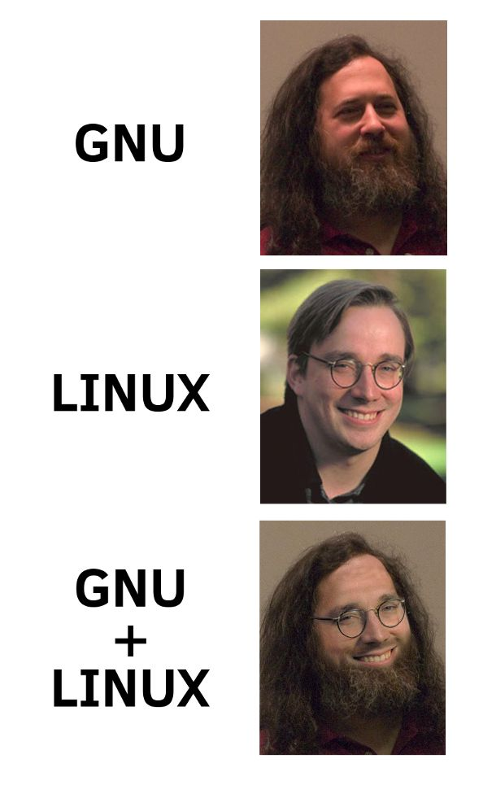
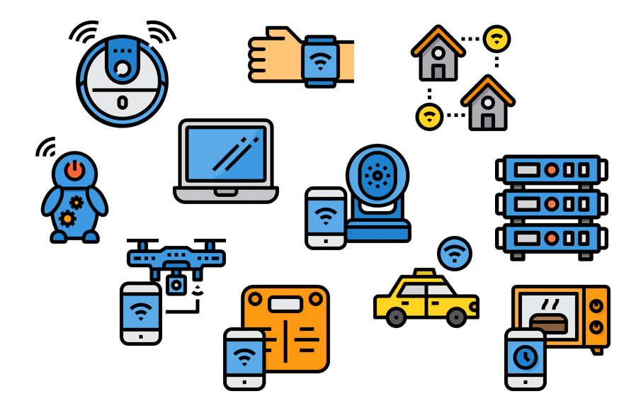

Introduction
===

<!-- column_layout: [1, 1] -->

<!-- column: 0 -->

# About us

- Pius & Philipp
- Studied CS back in 2019
- First time lecture this year
  - We need your feedback!

<!-- column: 1 -->

# About you

Quickly introduce yourself:

- Who are you?
- Which Operating Systems did you use previously
  - Windows, MacOS, Linux? Or only mobile devices?

<!-- end_slide -->

Organizational
===

- 5 lectures between 2 and 4.5 hours
- Mostly hands-on
  - You'll need your own Linux system
- Introduction into Linux system components
  - Installation
  - Basic & advanced terminal commands
  - Building applications and containers
- Practical lab work submissions
  

<!-- end_slide -->

What is Linux?
===

<!-- column_layout: [1, 2] -->


<!-- column: 0 -->




<!-- column: 1 -->



<!-- reset_layout -->

> https://img.devrant.com/devrant/rant/r_1578772_VbG6J.jpg | Icons by flaticon.com

<!-- end_slide -->

Advantages of Linux
===

- Runs (almost) everywhere
  - From low-power to high performance computing
- Open Source
- Customizable
- Free of charge

<!-- end_slide -->

Components of a Linux system
===

|Component           |Example             | Description |
|--------------------|-------             | ----------- |
|Bootloader          |grub, systemd-boot  | Starts the system |
|Kernel              |Linux               | Interfaces with hardware |
|Init System         |systemd / openrc    | Launches all other programs |
|Display Server      |X11, Wayland        | Renders the graphical |
||                                        | user interface (GUI)|
|Display Manager     |GDM, LightDM        | Graphical login screen |
|Desktop Environment |Gnome, KDE, XFCE    | Defines how your GUI looks like |
|GUI app libraries   | GTK, QT, Electron  | Allows building GUI apps with |
||                                        | different look and feel|
| Security Module    | SELinux, AppArmor  | Enhanced security regulation |

<!-- end_slide -->

Linux Desktop Environments
===

A **Desktop Environment (DE)** defines the look & feel of your Linux system

Includes: panels/menus, settings, file manager, system tools

| Desktop Environment | Characteristics                                  | Target audience                           |
| ------------------- | ------------------------------------------------ | ----------------------------------------- |
| **GNOME**           | Modern, minimal, keyboard-friendly               | Users who like a clean workflow           |
| **KDE Plasma**      | Highly customizable, Windows-like, many settings | Power users, tinkerers                    |
| **XFCE**            | Lightweight, classic interface                   | Older hardware, performance-focused       |
| **LXQt** / **LXDE** | Extremely lightweight                            | Very resource-constrained systems         |
| **Cinnamon**        | Traditional desktop (Windows-like)               | Linux Mint users, beginners               |
| **MATE**            | Fork of old GNOME 2, lightweight                 | Users who want a stable, classic desktop  |
| **Budgie**          | Modern, elegant, GNOME-based                     | Users who like simplicity + polish        |
| **Pantheon**        | macOS-like, minimalistic                         | Users who like macOS feel (elementary OS) |

- Choice of DE = personal preference → try several to find your favorite!
- DE is **not tied to the distro** → you can install others later

<!-- end_slide -->

What is a Linux Distribution?
===

- Windows, MacOS, etc. only have a single OS with different Versions
  - Windows 10, Windows 11, ...
- Linux has a much greater varierty of system components
  - Different Desktops, different init systems, different apps
- A Linux Distro bundles certain components together:
  - Different kernel versions, different desktops, different package repositories
- Distros are opinionated
  - Software selection based on certain preferences
  - Some distros only ship open source software components (Debian, Fedora)
  - Some distros compile everything from source (Gentoo)
  - Different out-of-the-box security configuration (SELinux, AppArmor, Firewall frontends)
  - Different package managers and package formats
  - Desktop vs Server focus
  - etc ...
  
<!-- end_slide -->

Which Linux Distros are there?
===

https://upload.wikimedia.org/wikipedia/commons/1/1b/Linux_Distribution_Timeline.svg

A couple to point out:

- Slackware is one of the oldest distros, but nowadays almost obsolete
- Debian is a very stable (mostly server) distro which focuses on free software (community driven)
- Ubuntu is a newcomer friendly distro based on Debian, owned by Canonical
- Fedora is a community driven distro that focuses on modern software and security
- ArchLinux, community driven, focuses on customization and has bleeding edge software
- Gentoo is a source based distro --> software is compiled locally
- NixOS is a declaratively configurable distro
- RedHat and SUSE offer Enterprise Linux
  - Alma and Rocky are community editions of RedHat Enterprise Linux (RHEL)
- Kali / ParrotOS are targeted towards pentesting/security auditing (no daily-driving)
- Alpine is a minimal Linux distro focusing on minimal overhead (e.g. resource-constraint hardware/containers)

<!-- end_slide -->

Which Linux Distros are there?
===


<!-- end_slide -->

Package Managers
===

- A **package manager** installs, updates, and removes software
- Keeps track of dependencies (software that other software needs)
- Different distros use different package managers and package formats:

| Distro Family / Type   | Package Manager               | Package Format                 |
| ---------------------- | ----------------------------- | ------------------------------ |
| Debian / Ubuntu        | `apt` / `dpkg`                | `.deb`                         |
| Fedora / RHEL          | `dnf` / `yum`                 | `.rpm`                         |
| Arch Linux             | `pacman`                      | `.pkg.tar.zst`                 |
| Alpine Linux           | `apk`                         | `.apk`                         |
| NixOS                  | `nix`                         | store paths                    |
| Universal formats      | `flatpak`, `snap`, `appimage` | portable                       |

> Some systems (e.g., rpm-ostree, transactional-update) are immutable - changes apply atomically after reboot.

> Most package managers can update the entire system with a single command!

> AppImage has no standardized package manager!

<!-- end_slide -->

Linux file system explained
===

```bash
/
├── bin -> usr/bin      # Essential user commands (ls, cp, mv)
├── boot                # Bootloader files (kernel, initramfs)
├── dev                 # Device files (e.g. /dev/sda, /dev/tty)
├── etc                 # System configuration files
├── home                # User home directories (/home/alice)
├── lib -> usr/lib      # Shared libraries for essential programs
├── lib64 -> usr/lib64  # 64-bit libraries
├── media               # Auto-mounted removable media (legacy)
├── mnt                 # Temporary mount points (manual)
├── opt                 # Optional / 3rd-party software
├── proc                # Virtual filesystem with process info
├── root                # Home directory for root user
├── run                 # Volatile runtime data (since last boot)
├── sbin -> usr/sbin    # System binaries (fsck, ip, systemctl)
├── srv                 # Data served by the system (web, ftp)
├── sys                 # Virtual filesystem for hardware devices
├── tmp                 # Temporary files (auto-cleared)
├── usr                 # User programs, libraries, docs
└── var                 # Variable data (logs, cache, spool)
```

- `/` is called the **root directory** - everything starts here
- Some directories are **virtual** (`/proc`, `/sys`) - they exist only in memory
- `/usr` contains most applications — `/bin` and `/sbin` are nowadays just symlinks

<!-- end_slide -->

Binaries & Their Locations
===

| Directory                  | Purpose                                                                                        |
| -------------------------- | ---------------------------------------------------------------------------------------------- |
| /bin                       | Essential user commands needed for booting and repairing the system (e.g., `ls`, `cp`, `mv`).  |
| /sbin                      | Essential system binaries for booting and administration (e.g., `fsck`, `ip`, `mount`).        |
| /usr/bin                   | Most user applications (non-essential, e.g., `vim`, `git`, `python`).                          |
| /usr/sbin                  | Admin and system tools that are not essential for booting (e.g., `sshd`, `apachectl`).         |
| /usr/local/bin             | Locally installed user applications (not managed by package manager).                          |
| /usr/local/sbin            | Locally installed system admin tools (manual builds, custom scripts).                          |
| /home/\<user\>/.local/bin/ | User-specific binaries installed via `pip`, `cargo`, `npm` etc. - only available to that user. |
| /opt/                      | 3rd-party applications - often entire self-contained software bundles                          |
|                            | (e.g., Google Chrome, proprietary tools).                                                      |

* Modern Linux: `/bin` and `/sbin` are often symlinks to `/usr/bin` and `/usr/sbin`
* Local and user-specific dirs let you install software without touching the system

> All standard directories are described in the file system hierarchy manual page - run `man hier` to read it.

<!-- end_slide -->

Drivers on Linux
===

- Drivers allow the **kernel** to talk to hardware
- Most drivers are included in the Linux kernel!
- Plug & Play is common:
  - Network adapters, USB devices, webcams usually work out of the box
- Exceptions:
  - Some GPUs (e.g., Nvidia) have proprietary drivers
  - Some Wi-Fi chipsets require extra firmware
  - Printers: Try to use AirPrint (driverless)
- Tools to check drivers:
  - `lspci`, `lsusb` -> list devices
  - `lsmod` -> list kernel modules (drivers)
  - `dmesg` -> check system log for driver messages

<!-- end_slide -->

How do I install my own distro?
===

We recommend using the latest version of Fedora Workstation from https://fedoraproject.org/workstation/

We also recommend installing it using dual boot or, if possible, as a complete Linux system - if you want to switch fully. We do not recommend using a VM.

# Preparing for Installation

- **Backup all of your data**
- Download the ISO file (and verify the checksum) or use the Fedora Media Writer
- Create a bootable media using `dd` or the Fedora Media Writer tool

# Installation

- Boot from your USB stick (use UEFI if possible)
- Fedora will boot into a live system, from where you can start the graphical installation
  1. Select the system language and keyboard layout
  2. Define the installation destination (the disk where you want Fedora installed). You can choose to use the entire disk or share it with an existing operating system (dual boot)
  3. Configure storage encryption (recommended for notebooks and portable devices for better security)
  4. Review your configuration and install Fedora Workstation

<!-- end_slide -->


 Thank you for your attention!

 Don't forget the feedback
