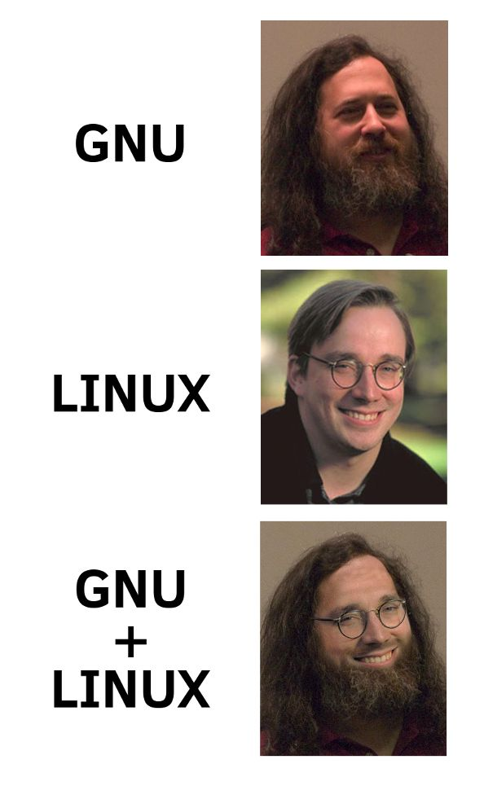

Introduction
===

<!-- column_layout: [1, 1] -->

<!-- column: 0 -->

# About us

- Pius & Philipp
- Studied CS back in 2019
- First Linux lecture in 2025
  - We still update/rework the lecture every year
  - We need your feedback!

<!-- column: 1 -->

<!-- pause -->

# About you

Quickly introduce yourself:

- Who are you?
- Which operating systems did you use previously
  - Windows, macOS, Linux? Or only mobile devices?

<!-- end_slide -->

Organizational
===

- 11 lectures, each 1.5 hours
- Mostly hands-on
  - You'll need your own Linux system
- Introduction into Linux system components
  - Installation
  - Basic & advanced terminal commands
  - Building applications and containers
- Practical lab work submissions

<!-- end_slide -->

What is Linux?
===


> Icons by flaticon.com

<!-- end_slide -->

What is Linux?
===

<!-- column_layout: [1, 2] -->

<!-- column: 0 -->



> https://img.devrant.com/devrant/rant/r_1578772_VbG6J.jpg

<!-- column: 1 -->

- In 1983, Richard Stallman started the GNU Project (**G**NU's **N**ot **U**nix)
  - Open source compiler (`gcc`), system library (`glibc`) and coreutils
  - But: Lacking a kernel

<!-- pause -->

- In 1991, Linus Torvalds developed his own kernel
  - Started as a hobby project
  - Similar to proprietary Unix, but open source

<!-- pause -->

- The components were combined to create a fully open source operating system

<!-- pause -->

- Could run programs originally developed for Unix
  - Fast adoption from developers

<!-- pause -->

When we say "Linux", we are referring to an entire operating system

- There are opinions that a Linux based system should be called "GNU/Linux"
- Nowadays: Memes about "systemd/Linux"

<!-- end_slide -->

Advantages of Linux
===

- Runs (almost) everywhere
  - From low-power to high performance computing (https://top500.org)
- Open Source
  - All source code is publicly available
  - Can be analyzed and modified to your liking
  - Great for academia
- Customizable/Configurable
- Free of charge\*

<!-- end_slide -->

Components of a Linux system
===

| Component             | Example            | Description                            |
| --------------------- | ------------------ | -------------------------------------- |
| Bootloader            | grub, systemd-boot | Starts the system                      |
| Kernel                | Linux              | Interfaces with hardware               |
| Init System           | systemd / openrc   | Starts and manages system services     |
| Display Server        | X11, Wayland       | Renders the graphical                  |
|                       |                    | user interface (GUI)                   |
| Display Manager       | GDM, LightDM       | Graphical login screen                 |
| Desktop Environment   | Gnome, KDE, XFCE   | Defines how your GUI looks and behaves |
| GUI toolkit/framework | GTK, QT, Electron  | Allows building GUI apps with          |
|                       |                    | different look and feel                |
| Security Framework    | SELinux, AppArmor  | Optional, enhanced security regulation |

<!-- pause -->

______________________________________________________________________

Most distros do not ship/configure a security framework by default

- AppArmor is shipped/enabled by default on Debian/Ubuntu
- SELinux is shipped/enabled by default on the RedHat distro family (including Fedora)
- SUSE provides both AppArmor and SELinux

<!-- end_slide -->

Linux Desktop Environments
===

A **Desktop Environment (DE)** defines the look & feel of your Linux system

Includes: panels/menus, settings, file manager, system tools

<!-- pause -->

| Desktop Environment | Characteristics                                  | Target audience                           |
| ------------------- | ------------------------------------------------ | ----------------------------------------- |
| **GNOME**           | Modern, minimal, keyboard-friendly               | Users who like a clean workflow           |
| **KDE Plasma**      | Highly customizable, Windows-like, many settings | Power users, tinkerers                    |
| **COSMIC**          | Gnome-inspired, written in Rust, supports tiling | Power users who like simplicity           |
| **XFCE**            | Lightweight, classic interface                   | Older hardware, performance-focused       |
| **LXQt** / **LXDE** | Extremely lightweight                            | Very resource-constrained   systems       |
| **Cinnamon**        | Traditional desktop (Windows-like)               | Linux Mint users, beginners               |
| **MATE**            | Fork of old GNOME 2, lightweight                 | Users who want a stable, classic desktop  |
| **Budgie**          | Modern, elegant, GNOME-based                     | Users who like simplicity + polish        |
| **Pantheon**        | macOS-like, minimalistic                         | Users who like macOS feel (elementary OS) |

<!-- pause -->

______________________________________________________________________

> Choice of DE = personal preference -> try several to find your favorite!

> DE is **not tied to the distro** -> you can install others later

<!-- end_slide -->

What is a Linux Distribution?
===

- Windows, macOS, etc. only have a single OS with different Versions
  - Windows 10, Windows 11, ...

<!-- pause -->

- Linux has a much greater variety of system components
  - Different Desktops, different init systems, different apps

<!-- pause -->

- A Linux Distro bundles certain components together:
  - Different kernel versions, different desktops, different package repositories
  - Distros support various release cycles and models

<!-- pause -->

- Distros are opinionated
  - Software selection based on certain preferences
  - Some distros only ship open source software components (Debian, Fedora)
  - Some distros compile everything from source (Gentoo)
  - Different out-of-the-box security configuration (SELinux, AppArmor, Firewall frontends)
  - Different package managers and package formats
  - Desktop vs Server focus
  - etc ...

<!-- end_slide -->

Which Linux Distros are there?
===

https://upload.wikimedia.org/wikipedia/commons/1/1b/Linux_Distribution_Timeline.svg

<!-- pause -->

A couple to point out:

- **Slackware** is one of the oldest distros, but nowadays almost obsolete
- **Debian** is a very stable (mostly server) distro which focuses on free software (community driven)
- **Ubuntu** is a newcomer friendly distro based on **Debian**, owned by Canonical
- **Linux Mint** is likely the most recommended newcomer distro based on **Debian** _or_ **Ubuntu**

<!-- pause -->

- **Arch Linux**, community driven, focuses on customization and has bleeding edge software
- **Gentoo** is a source based distro -> software is compiled locally
- **NixOS** is a declarative configurable distro

<!-- pause -->

- **Fedora** is a community driven distro that focuses on modern software and security
- **RedHat** and **SUSE** offer _Enterprise Linux_ (paid)
  - **Alma** and **Rocky** are community editions of **RedHat Enterprise Linux** (RHEL)
  - **SUSE Linux Enterprise Server** (SLES) has free community editions **Leap** and **Tumbleweed**
  - **Fedora** used as **RHEL** upstream -> Community + RedHat driven
  - **Ubuntu LTS** is considered _Enterprise Linux_ as well

<!-- pause -->

- **Kali**/**Parrot OS** are targeted towards pentesting/security auditing (no daily-driving)
- **Alpine** is a minimal Linux distro focusing on minimal overhead (e.g., resource-constraint hardware/containers)

<!-- end_slide -->

Which Linux Distros are there?
===


<!-- end_slide -->

Linux distro release cycles
===

| Distro              | Release model            | Cadence & support lifecycle                                   |
| ------------------- | ------------------------ | ------------------------------------------------------------- |
| **Slackware**       | Fixed / irregular        | No fixed cadence; long-lived releases                         |
| **Debian**          | Fixed                    | ~2 yr; ~5 yr support                                          |
| **Ubuntu**          | Fixed                    | Each April and October; 9 mo support                          |
| **Ubuntu LTS**      | Fixed                    | ~2 yr; ~5 yr support (10 yr when paid)                        |
| **Linux Mint**      | Fixed                    | ~2 yr; follows Ubuntu LTS                                     |
| **Fedora**          | Fixed                    | ~6 mo; ~1 yr support                                          |
| **Arch Linux**      | Rolling                  | Continuous; no fixed lifecycle                                |
| **Gentoo**          | Rolling                  | Continuous; no fixed lifecycle                                |
| **NixOS**           | Fixed / rolling channels | ~6 mo; stable channels maintained                             |
| **RHEL**            | Fixed / enterprise       | Major ~3–4 yr; 10 yr lifecycle (multiple minor versions)      |
| **SUSE SLES**       | Fixed                    | Major ~3 yr; minor ~1 yr; ~5 yr support (LTS extends further) |
| **SUSE Leap**       | Fixed                    | ~2 yr; ~2 yr support                                          |
| **SUSE Tumbleweed** | Rolling                  | Continuous; no fixed lifecycle                                |
| **Alpine**          | Fixed + rolling edge     | ~2–3 releases/yr; defined support period                      |

<!-- pause -->

> No, this will not be an exam question ;)

<!-- end_slide -->

Installing Software
===

<!-- column_layout: [2, 3] -->

<!-- column: 0 -->

# Windows

## Traditional

- `.exe` or `.msi` as **installer**
  - Manually downloaded from some website
- Contains required application files or downloads them from the internet
- Each application ships all dependencies by itself -> no sharing

<!-- pause -->

## Modern

- Winget (CLI package manager) or Microsoft Store
  - No need to download some sketchy installer
  - Each program still ships all its dependencies

<!-- column: 1 -->

<!-- pause -->

# Linux

## Traditional

- Package managers
  - Every application is installed via system package manager
  - Each distro provides its own repositories with different packages and versions
- Shared libraries are packaged as dependencies
  - Applications actually reuse shared dependencies
  - Upside: Much more space efficient
  - Downside: More complicated packaging, "dependency hell"

<!-- pause -->

## Modern

- AppImage: Self-contained binary (no package manager)
- Snap: Package manager for self-contained applications (GUI + CLI), proprietary store operated by canonical
- Flatpak: Package manager (decentralized) for sandboxed, self-contained GUI applications
- Toolpak: Supposed to be flatpak for CLI

<!-- end_slide -->

Package Managers
===

A **package manager**

- installs, updates, and removes software
- keeps track of dependencies (e.g., libraries required by applications)

Different distros use different package managers and package formats:

| Distro Family / Type | Package Manager               | Package Format |
| -------------------- | ----------------------------- | -------------- |
| Debian / Ubuntu      | `apt` / `dpkg`                | `.deb`         |
| Fedora / RHEL        | `dnf` / `yum`                 | `.rpm`         |
| Arch Linux           | `pacman`                      | `.pkg.tar.zst` |
| Alpine Linux         | `apk`                         | `.apk`         |
| NixOS                | `nix`                         | store paths    |
| Universal formats    | `flatpak`, `snap`, `appimage` | portable       |

> Some systems (e.g., rpm-ostree, transactional-update) are immutable - changes apply atomically after reboot.

> Most package managers can update the entire system with a single command!

<!-- end_slide -->

Linux file system explained
===

In Windows, different disk partitions have different letters.

In Linux, there is the file system tree. Directories in the tree are separated via `/`.

Each disk can be _mounted_ at any path in the tree.

<!-- pause -->

`/` is called the **root directory** -> everything starts here

<!-- pause -->

Some directories are **virtual**

- e.g. (`/proc`, `/sys`)
- these directories exist only in memory and are not stored on the disk

<!-- end_slide -->

Linux file system explained
===

```bash
/
├── bin -> usr/bin      # Essential user commands (ls, cp, mv)
├── boot                # Bootloader files (kernel, initramfs)
├── dev                 # Device files (e.g. /dev/sda, /dev/tty)
├── etc                 # System configuration files
├── home                # User home directories (/home/alice)
├── lib -> usr/lib      # Shared libraries for essential programs
├── lib64 -> usr/lib64  # 64-bit libraries
├── media               # Auto-mounted removable media (legacy)
├── mnt                 # Temporary mount points (manual)
├── opt                 # Optional / 3rd-party software
├── proc                # Virtual filesystem with process info
├── root                # Home directory for root user
├── run                 # Volatile runtime data (since last boot)
├── sbin -> usr/sbin    # System binaries (fsck, ip, systemctl)
├── srv                 # Data served by the system (web, ftp)
├── sys                 # Virtual filesystem for hardware devices
├── tmp                 # Temporary files (auto-cleared)
├── usr                 # User programs, libraries, docs
└── var                 # Variable data (logs, cache, spool)
```

<!-- end_slide -->

Binaries & Their Locations
===

| Directory                 | Purpose                                                                                        |
| ------------------------- | ---------------------------------------------------------------------------------------------- |
| /bin                      | Essential user commands needed for booting and repairing the system (e.g., `ls`, `cp`, `mv`).  |
| /sbin                     | Essential system binaries for booting and administration (e.g., `fsck`, `ip`, `mount`).        |
| /usr/bin                  | Most user applications (non-essential, e.g., `vim`, `git`, `python`).                          |
| /usr/sbin                 | Admin and system tools that are not essential for booting (e.g., `sshd`, `apachectl`).         |
| /usr/local/bin            | Locally installed user applications (not managed by package manager).                          |
| /usr/local/sbin           | Locally installed system admin tools (manual builds, custom scripts).                          |
| /home/\<user>/.local/bin/ | User-specific binaries installed via `pip`, `cargo`, `npm` etc. - only available to that user. |
| /opt/                     | 3rd-party applications - often entire self-contained software bundles                          |
|                           | (e.g., Google Chrome, proprietary tools).                                                      |

<!-- pause -->

______________________________________________________________________

- Modern Linux: `/bin` and `/sbin` are often symlinks to `/usr/bin` and `/usr/sbin`
- Local and user-specific directories let you install software without touching the system

<!-- pause -->

> All standard directories are described in the file system hierarchy manual page - run `man hier` to read it.

<!-- end_slide -->

Drivers on Linux
===

- Drivers allow the **kernel** to talk to hardware

<!-- pause -->

- Most drivers are included in the Linux kernel -> No need for manual installation

<!-- pause -->

- Plug & Play is common:
  - Network adapters, USB devices, webcams usually work out of the box

<!-- pause -->

- Exceptions:
  - Some GPUs (e.g., Nvidia) have proprietary drivers
  - Some Wi-Fi chipsets require extra firmware
  - Printers: Try to use AirPrint (driverless)

<!-- pause -->

- Tools to check drivers:
  - `lspci`, `lsusb` -> list devices
  - `lsmod` -> list kernel modules (drivers)
  - `dmesg` -> check system log for driver messages
  - More on that in the later lectures

<!-- end_slide -->

How do I install my own distro?
===

We recommend using the latest version of Fedora Workstation from https://fedoraproject.org/workstation/

Installing Fedora as dedicated Linux system or via dual boot (if you want to keep Windows) is recommended. We do not recommend using a VM.

<!-- pause -->

# Preparing for Installation

- **Back up all of your data**
- Download the ISO file (and verify the checksum) or use the Fedora Media Writer
- Create a bootable media using `dd` or the Fedora Media Writer tool

<!-- pause -->

# Installation

- Boot from your USB stick (use UEFI if possible)
- Fedora will boot into a live system, from where you can start the graphical installation
  1. Select the system language and keyboard layout
  2. Define the installation destination (the disk where you want Fedora installed). You can choose to use the entire disk or share it with an existing operating system (dual boot)
  3. Configure storage encryption (recommended for notebooks and portable devices for better security)
  4. Review your configuration and install Fedora Workstation

<!-- end_slide -->

Thank you!
===

Thank you for your attention!

Don't forget the feedback in Moodle please!
