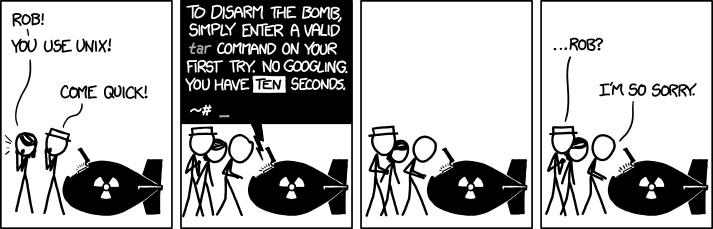

Coreutils & Command-Line Tools
===

- **Goal of this lecture**
  - Learn the basic Linux command-line tools
  - Understand what they do and when to use them
  - Practice with useful flags

- **Why?**
  - Mastering the CLI -> faster, more precise, automatable workflows
  - Essential for sysadmin, security, development work (and the upcoming semesters)

<!-- end_slide -->

Navigating the File System
===

| Command | Description                                 | Useful Flags / Examples                                             |
| ------- | ------------------------------------------- | ------------------------------------------------------------------- |
| `pwd`   | **P**rint current **w**orking **d**irectory |                                                                     |
| `ls`    | **L**i**s**t directory contents             | `-l` long format, `-a` show hidden files, `-h` human-readable sizes |
| `cd`    | **C**hange **d**irectory                    | `cd -` go back to previous directory                                |
| `tree`  | Show directory structure                    | `-L 2` limit depth, `-a` show hidden files                          |

<!-- pause -->

> `ranger`, `lf`, `mc`, `yazi` are terminal file managers

<!-- end_slide -->

Viewing Files
===

| Command | Description              | Useful Flags / Examples                         |
| ------- | ------------------------ | ----------------------------------------------- |
| `cat`   | Show file contents       | `cat file.txt`                                  |
| `less`  | View file page by page   | `/text` search forward, `?text` search backward |
| `head`  | Show first lines of file | `-n 20` show first 20 lines                     |
| `tail`  | Show last lines of file  | `-f` follow file (useful for logs)              |

<!-- end_slide -->

File Manipulation
===

| Command | Description                          | Useful Flags / Examples                              |
| ------- | ------------------------------------ | ---------------------------------------------------- |
| `cp`    | Copy files/directories               | `-r` recursive, `-i` interactive (confirm overwrite) |
| `mv`    | Move/rename files                    | `-i` confirm overwrite                               |
| `rm`    | Remove files                         | `-r` recursive, `-i` confirm, `-f` force             |
| `mkdir` | Create directory                     | `-p` create parent dirs if missing                   |
| `touch` | Create empty file / update timestamp |                                                      |

⚠️ **Danger Zone:** `rm -rf /` will erase **everything** - don't run this!

<!-- end_slide -->

File Permissions & Ownership
===

| Command | Description                        | Useful Flags / Examples                    |
| ------- | ---------------------------------- | ------------------------------------------ |
| `ls -l` | Show permissions and ownership     | `-h` human-readable sizes                  |
| `chmod` | Change file permissions            | `chmod 644 file.txt`, `chmod +x script.sh` |
| `chown` | Change owner                       | `chown user:group file.txt`                |
| `umask` | Show / set default permission mask |                                            |

Permissions refresher: `r=read, w=write, x=execute`

<!-- end_slide -->

Finding Files & Text
===

| Command  | Description                     | Useful Flags / Examples                                  |
| -------- | ------------------------------- | -------------------------------------------------------- |
| `find`   | Search for files                | `find /etc -name "*.conf"`                               |
| `locate` | Search files via prebuilt index | `updatedb` updates index                                 |
| `grep`   | Search inside files             | `-i` ignore case, `-r` recursive, `-n` show line numbers |
| `which`  | Show full path of command       | `which python3`                                          |

<!-- end_slide -->

System Info
===

| Command        | Description                   | Useful Flags / Examples        |
| -------------- | ----------------------------- | ------------------------------ |
| `uname`        | Show system info              | `-a` all details               |
| `uptime`       | Show uptime & load average    |                                |
| `df`           | Show disk usage               | `-h` human-readable sizes      |
| `du`           | Show space used by files/dirs | `-sh` summarize directory size |
| `free`         | Show memory usage             | `-h` human-readable            |
| `top` / `htop` | Show running processes        | `htop` = interactive           |

<!-- end_slide -->

Archiving & Compression
===

| Command             | Description         | Useful Flags / Examples                                                           |
| ------------------- | ------------------- | --------------------------------------------------------------------------------- |
| `tar`               | Archive files       | `tar -czvf file.tar.gz dir/` (**c**reate + g**z**ip + ***v***erbose + ***f***ile) |
|                     |                     | `tar -xzvf file.tar.gz` (e**x**tract + g**z**ip + ***v***erbose + ***f***ile)     |
| `gzip` / `gunzip`   | Compress/decompress | `gunzip --keep archive.gz`                                                        |
| `bzip2` / `bunzip2` | Compress/decompress | `bunzip2 --keep archive.bz2`                                                      |
| `xz` / `unxz`       | Compress/decompress | `unxz --keep archive.xz`                                                          |
| `zip` / `unzip`     | Compress/decompress | `unzip archive.zip`                                                               |

> https://xkcd.com/1168/

<!-- end_slide -->

Networking Basics
===

| Command            | Description              | Useful Flags / Examples           |
| ------------------ | ------------------------ | --------------------------------- |
| `ping`             | Test connectivity        | `ping -c 4 google.com`            |
| `curl`             | Transfer data from URLs  | `-O` save file, `-I` headers only |
| `wget`             | Download files from web  | `-r` recursive download           |
| `ss` / `netstat`   | Show network connections | `ss -tulnp` show listening ports  |
| `dig` / `nslookup` | DNS queries              | `dig A example.com`               |

<!-- end_slide -->

User Management
===

| Command  | Description               | Useful Flags / Examples   |
| -------- | ------------------------- | ------------------------- |
| `whoami` | Show current user         |                           |
| `id`     | Show user/group IDs       |                           |
| `who`    | Show logged-in users      |                           |
| `groups` | Show groups you belong to |                           |
| `sudo`   | Run command as root       | `sudo -i` open root shell |

<!-- end_slide -->

Other Handy Tools
===

| Command   | Description                   | Useful Flags / Examples  |
| --------- | ----------------------------- | ------------------------ |
| `man`     | Show manual pages             | `man ls`                 |
| `history` | Show command history          | `!42` rerun command #42  |
| `alias`   | Define shortcuts              | `alias ll="ls -l"`       |
| `date`    | Show/set system date          | `date +"%Y-%m-%d %H:%M"` |
| `watch`   | Repeat a command periodically | `watch -n 1 free -h`     |

<!-- end_slide -->

Hands-On Exercises
===

- Navigate your file system (`cd`, `pwd`, `ls -l`)
- Create, copy, move, delete some files and directories
- Check permissions, change them with `chmod`
- Search for a config file in `/etc` using `find`
- Watch system resource usage with `top` / `htop`
- Download a file with `wget` or `curl`
- Compress and extract a directory using `tar`

> 💡 **Tip:** Use `man <command>` whenever you're unsure what a command does!

